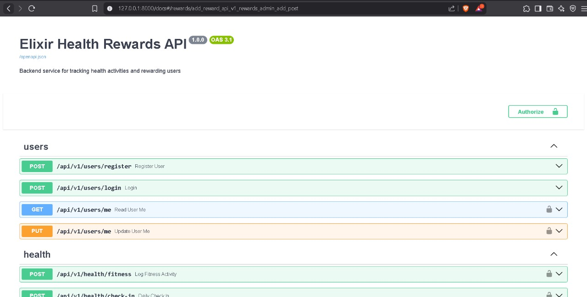
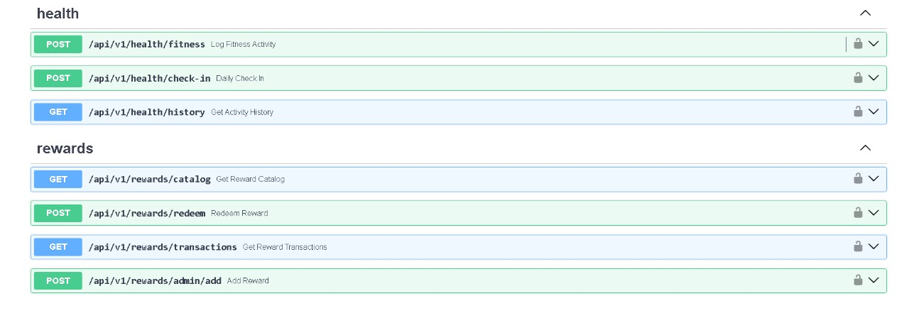

# 💪 HealthReel – Get Rewarded for Getting Healthier

What if your fitness tracker also tracked your **rewards**?  
**Elixir** is a smart health-fintech app that turns your daily fitness activities like GYM,  into points that can be redeemed with India’s top health brands. Because every rep, run, and routine should *earn* something back. 💸

---

## 🚀 Features

- 🎯 **Track Health Investments:** Log doctor visits, protein purchases, gym memberships, etc.
- 🧮 **Elixir Score:** Your dynamic health score that reflects your investment in wellness
- 🪙 **Reward Points System:** Earn rewards and redeem them on exiciting gifts
- 🔐 **JWT-based Auth:** Secure and fast login experience
- ⚙️ **FastAPI Backend:** Super fast, lightweight, and modern

---

## 🖼️ UI Preview

---

## ⚒️ Tech Stack

- Python 🐍
- FastAPI ⚡
- SQLAlchemy 🧩
- JWT Authentication 🔐
- GitHub Actions (optional CI) 🛠️

Why This Project?
Because staying fit is not just your goal, but my goal too. And I strongly encourage my friends and family to get into fitness. So why not join hands to fulfil this mission!

Made with 💚 by Aryan R
